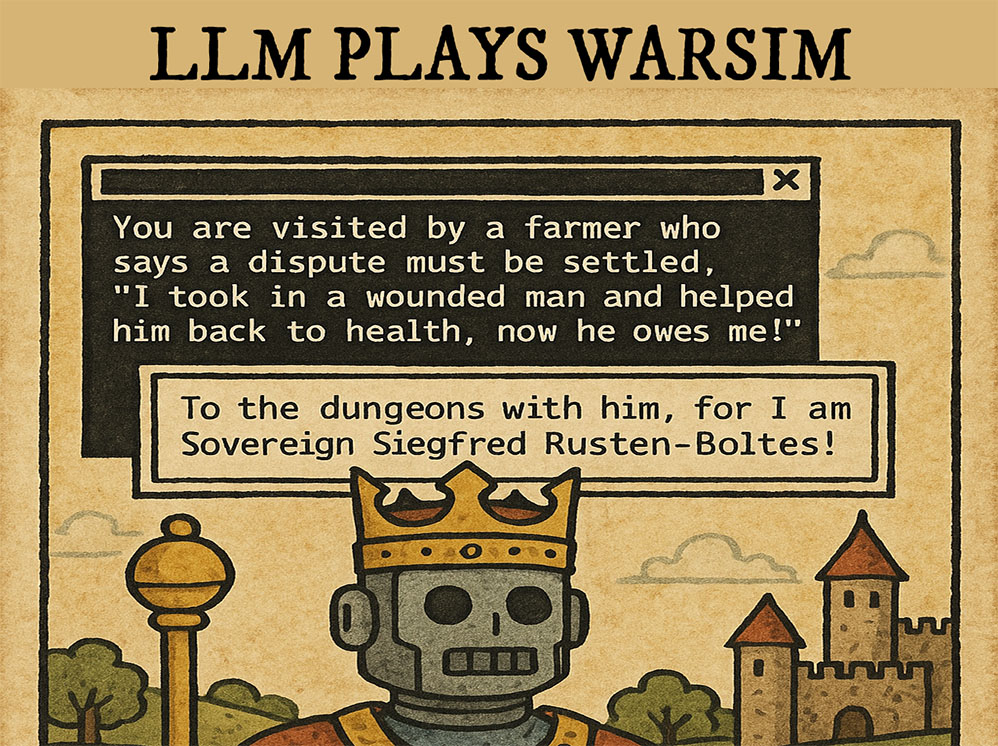

<p align="center">
  
</p>

# LLMPlaysWarsim
 LLM Plays Warsim uses Google Gen AI SDK to interact with the game Warsim. Or at least that's the idea.

## Quickstart
- Clone project, install requirements. Python 3.9+ Needed, Windows 10+ needed
- Get Gemini API key (free api key available from Google), and either set it in an .env file or system environment variables.
```GOOGLE_API_KEY=KEY_HERE```
- In Warsim, manually disable ASCII in the settings
- Have Warsim already running and in the game main menu (does not support starting from kingdom menu yet)
- Run the pyw script (```pythonw main.pyw```).
- Note: Make sure the game console is sized so that all text is visible to you. You can resize the font and have the game unfocused without issue, but all lines in the game have to be visible for this to work. 


## What this does
- Looks for existing save game (default LLMSave.txt), if it does not exist, quickstarts new game, enables autorecruitment, then passes off to LLM.
- Rough support for existing save game, some memory settings aren't properly handled.
- Agent, which automates tasks outside of the LLM, handles things like saving, loading.

## Memory system
- Partially implemented, details TBD

## Infrequently Asked Questions
- Why autorecruitment?
  - Without proper goal orientation, the LLM would struggle to link things like recruiting or enslaving x amount of people to obtain x battlescore or x income. It would get lost in the numerous settings, and it already spends too much time in the damn reports menu.

